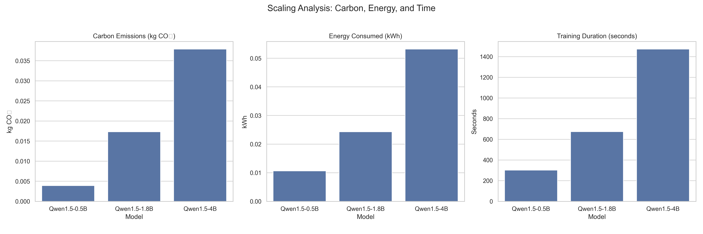
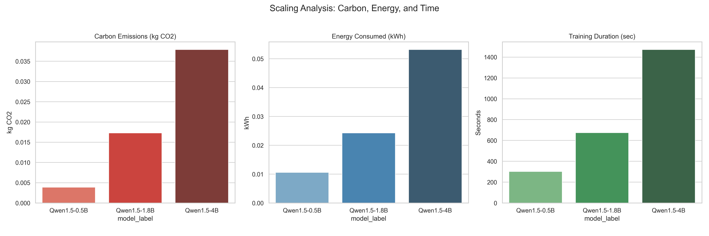

# 🚀 LLM Scaling & Efficiency Analysis using Qwen (LoRA Fine-Tuning)

## 📌 Overview

This project presents a **comparative study of Large Language Models (LLMs)** focusing on:

* 📈 Performance vs Model Scaling
* ⚡ Energy Consumption
* 🌍 Carbon Emissions

We fine-tune multiple **Qwen 1.5 models (0.5B, 1.8B, 4B)** using **LoRA (Low-Rank Adaptation)** and evaluate their efficiency and performance on an NLP task.

---

## 🎯 Objective

The goal of this project is to answer:

> ❝ Does increasing model size always justify the computational and environmental cost? ❞

---

## 🧠 Key Contributions

* ✅ Fine-tuned multiple LLM sizes using **LoRA (PEFT)**
* ✅ Measured **training time, energy consumption, and CO₂ emissions**
* ✅ Evaluated model performance using **ROUGE metrics**
* ✅ Analyzed **scaling laws vs efficiency trade-offs**
* ✅ Built a **Green AI perspective on LLM scaling**

---

## 🏗️ Project Structure

```
MAJOR_8THSEM/
│
├── Qwen1.5-*                  # Base models (ignored in git)
├── Qwen1.5-*_final_lora/     # LoRA adapters (ignored in git)
│
├── qwen_tokenized/           # Tokenized dataset (ignored)
│
├── step2_data_prep_qwen.py
├── step3_train_qwen_scaling.py
├── step4_evaluate_qwen.py
├── step5_plot_results.py
├── step6_final_research_plots.py
├── step7_final_inference_compare.py
│
├── final_csv.csv             # Energy & emission results
├── qwen_rouge_results.csv    # Performance metrics
├── emissions.csv             # Carbon tracking data
│
├── final_scaling_plot.png
├── scaling_analysis.png
├── FINAL.TXT
```

---

## ⚙️ Methodology

### 1️⃣ Data Preparation

* Tokenization using Qwen tokenizer
* Train/validation split

### 2️⃣ Fine-Tuning

* Technique: **LoRA (Parameter Efficient Fine-Tuning)**
* Models:

  * Qwen1.5-0.5B
  * Qwen1.5-1.8B
  * Qwen1.5-4B

### 3️⃣ Evaluation

* Metric: **ROUGE Score**
* Task: NLP (e.g., summarization)

### 4️⃣ Efficiency Tracking

* ⏱ Training duration
* ⚡ Energy consumption (kWh)
* 🌍 Carbon emissions (kg CO₂)

---

## 📊 Results (Efficiency Analysis)

| Model | Time (sec) | Energy (kWh) | Emissions (kg CO₂) |
| ----- | ---------- | ------------ | ------------------ |
| 0.5B  | 301.78     | 0.0106       | 0.0039             |
| 1.8B  | 674.52     | 0.0243       | 0.0173             |
| 4B    | 1472.93    | 0.0532       | 0.0379             |

---

## 🔍 Key Insights

* 📈 Model scaling leads to **superlinear increase in compute cost**
* ⚡ Energy consumption grows significantly with model size
* 🌍 Carbon emissions increase disproportionately (~10x)
* 🧠 Smaller models + LoRA offer **better efficiency-performance balance**

---

## 📉 Scaling Visualization





---

## 🚀 How to Run

### 1️⃣ Clone the Repository

```bash
git clone https://github.com/your-username/your-repo-name.git
cd your-repo-name
```

### 2️⃣ Install Dependencies

```bash
pip install -r requirements.txt
```

### 3️⃣ Run Pipeline

```bash
# Step 1: Data Preparation
python step2_data_prep_qwen.py

# Step 2: Training
python step3_train_qwen_scaling.py

# Step 3: Evaluation
python step4_evaluate_qwen.py

# Step 4: Plot Results
python step5_plot_results.py
```

---

## 🧪 Future Work

* 🔬 Extend to larger models (7B, 13B)
* ⚡ Optimize training using quantization
* 🌍 Improve carbon tracking accuracy
* 📊 Benchmark across multiple datasets

---

## 📚 Research Direction

This project aligns with **Green AI** and **Efficient Deep Learning**, focusing on:

* Sustainable AI systems
* Cost-aware model design
* Performance vs efficiency trade-offs

---

## 👨‍💻 Author

**Subhadip Das**
B.Tech Electronics & Computer Science (KIIT)

---

## ⭐ If you found this useful

Give it a star ⭐ and feel free to contribute!
